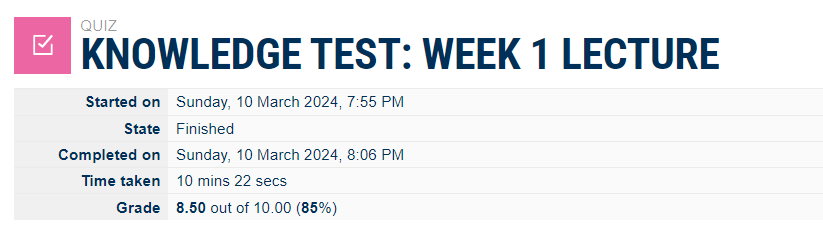
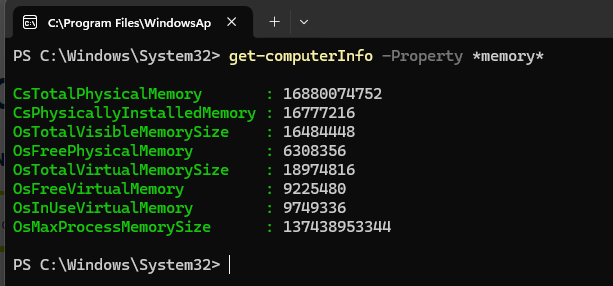
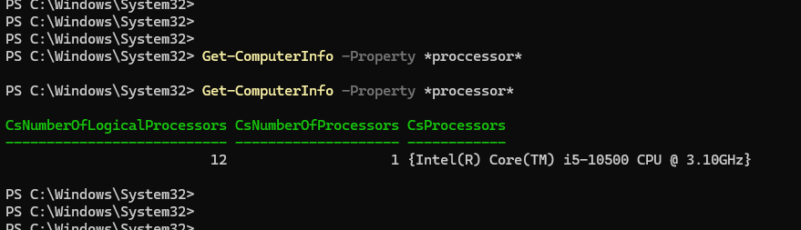
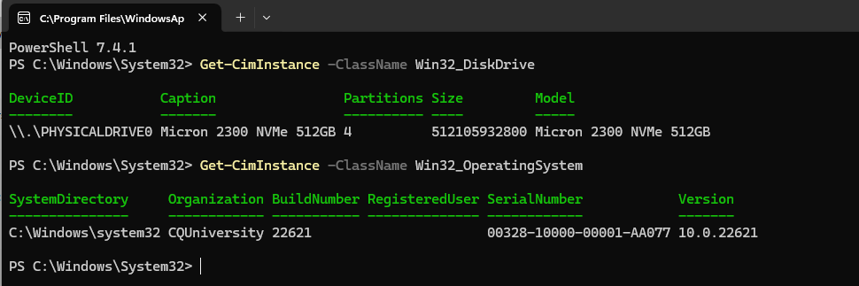
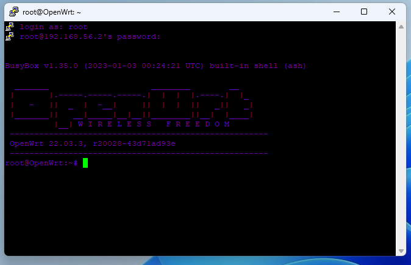
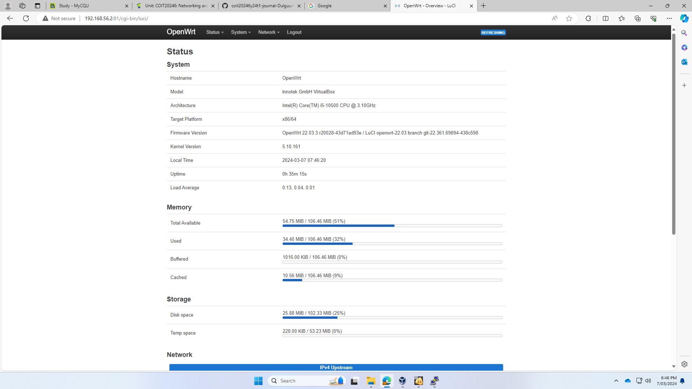

# Week 1 | Computer Systems and Applications

## Task 1. Complete the Knowledge Test [10 minutes]  
Completed knowledge test  

## Task 2. Create GitHub Account [10 min]
Created my GitHub account that is here  

## Task 3. View Your Computer Information

PS C:\Windows\System32> Get-ComputerInfo -Property *memory*

CsTotalPhysicalMemory       : 16898920448  
CsPhysicallyInstalledMemory : 16777216  
OsTotalVisibleMemorySize    : 16502852  
OsFreePhysicalMemory        : 7382552  
OsTotalVirtualMemorySize    : 18993220  
OsFreeVirtualMemory         : 9250912  
OsInUseVirtualMemory        : 9742308  
OsMaxProcessMemorySize      : 137438953344  

The following is a screenshot of the details: Computer memory:
  
Computer processor:

PS C:\Windows\System32> Get-CimInstance -ClassName Win32_DiskDrive  
PHYSICALDRIVE0 Micron 2300 NVMe 512GB 4  
This is the size of disk drive - 512105932800  
Micron 2300 NVMe 512GB  

PS C:\Windows\System32> Get-CimInstance -ClassName Win32_OperatingSystem  
OS version - C:\Windows\system32 10.0.22621  
Organization - CQUniversity 22621              
Serial number - 00328-10000-00001-AA077  

## Task 4. Deploy Linux Web Server in VirtualBox

Write about boot manager and kernel version - 
In my understanding, the boot manager is a software that does some low level action before OS starts like to format the hard disk and to chose Operation Systems so on..
The kernel version works bewteen the boot manager and Operation System that starts core OS functionality and loads external modules

ChatGPT - 
A boot manager is software that facilitates the selection and loading of operating systems during computer startup. It allows users to choose between different operating systems or configurations. The kernel version refers to the core of an operating system, managing hardware resources and providing essential functionality.
Write about virtual box

Comparision of me and ChatGPT - 
My description emphasizes the low-level actions and technical tasks performed by the boot manager, such as formatting disks and selecting operating systems.
ChatGPT focuses more on the functionality and purpose of the boot manager, highlighting its role in enabling users to choose between different operating systems during startup.
Overall, both descriptions provide valuable insights into the boot manager and kernel version, with each emphasizing different aspects of their functionality and role in the computer startup process.

Write about openwrt - 
This software is developed for the router to configure the entire network and security purpose. That can show us various range of options to organise about the network system.

ChatGPT - 
OpenWrt is an open-source Linux-based operating system designed for embedded devices such as routers. It provides a customizable platform for networking enthusiasts and developers to modify and enhance router functionality. OpenWrt offers features like package management, firewall, and VPN support, empowering users to tailor their network configurations.

## Task 5. Browse to OpenWRT Websites

CPU, RAM, disk sizes, OS version  
CPU = Intel(R) Core(TM) i5-10500 CPU @ 3.10GHz  
Ram = 106.56 Mib (megabyte)  
disk size = 102.33 Mib  
os version = lunix 2.6  
