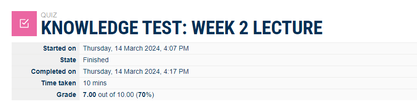
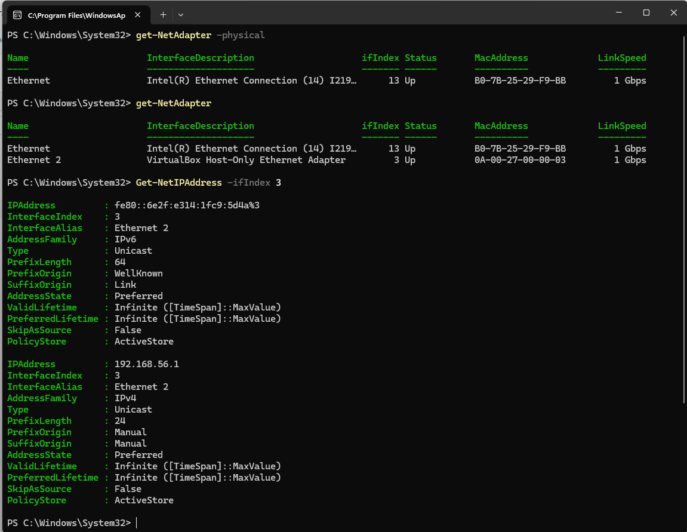
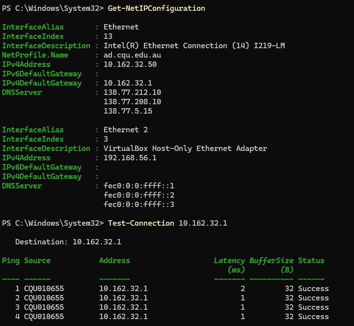
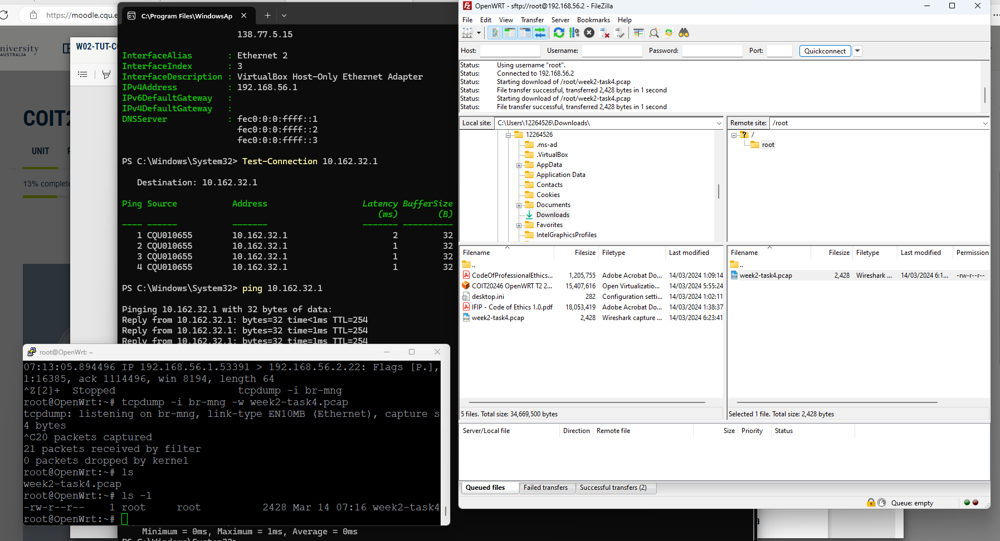
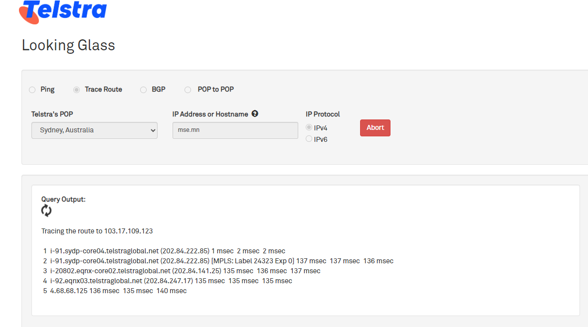
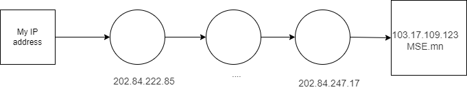
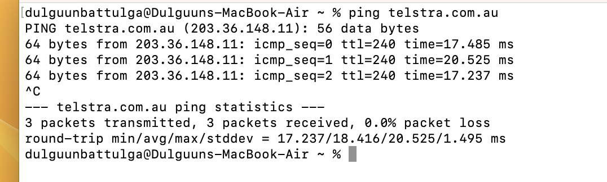
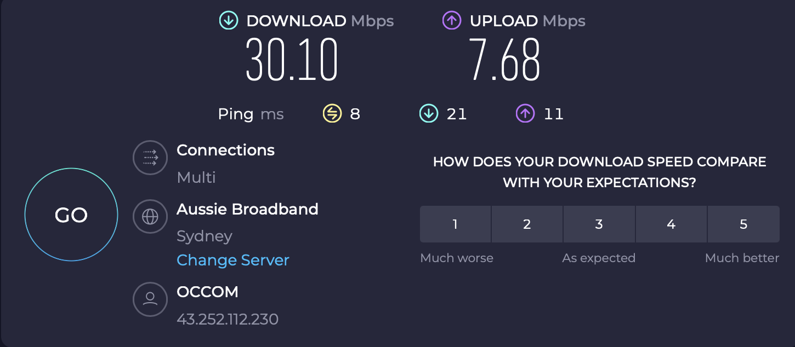

# Week 2 | Computer Networks and the Internet

## Task 1. Complete the Knowledge Test [10 min]

## Task 2. View Your Addresses [15 min]

  
2 addresses are shown in this screenshot.   
First one is physical address, index 13, has MAC address, link speed is 1 Gbps  
last one is virtual address index 3, has MAC address, link speed is 1 Gbps

## Task 3. Ping Your Local Router [15 min]

 Screenshot(s) of commands/outputs.
 
• List the values of delays and explain how you found them.  
There is a Latency on the screenshot that describe the delay. In my case there are 2ms, 1ms, 1ms those describe a delay between from my computer to destination router. 

• Discuss the factors that impact delay.  
Delay is depends on Network Congestion, Bandwidth Limitations, Router Performance, Signal Strength, Network Configuration so on..

## Task 4. Ping your OpenWRT Linux Server [20 min]

Uploaded week2-task4.pcap file into image folder

[Checking ping](./images/week2-task4.pcap) - file is here

In your journal:
Openwrt -> download file -> import downloaded file -> choose MACaddress 3rd option -> enter  
start Putty root:root, password student  
On Putty -> command -> "ip link"  
br - mng -> Real Macaddress  
Capture the package from Windows to Linux  
tcpdump -i br-mng -w week4task4.pcap  
Cancel command - Ctrl + C  
Open Filezilla - use to download file from Lunix Virtual Machine

## Task 5. Trace Path Through the Internet [20 min]

  
This https://www.ausnog.net/tools/lg) link is for check the delay and how many routers are between my PC and destination PC. In my case, I checked trace router to mse.mn that is Mongolian stock exchange website. We can see there are a lot of traffic conjuction bewteen us. For example second router delay is 137msec 137msec 136msec,  
Source destination is my IP address  
Destination router ip address is 103.17.109.123  

## Task 6. Draw a Network Diagram [20 min]

  
This is Network diagram about ping from my PC to MSE.mn  
Here is a [File draw](./images/tracerouter.drawio.xml)  . 

## Task 7. Find Addresses of a Website [20 min, Homework]

First I use open command promt in my computer. To send ping to the website(domain). After that will show me ip address of the domain name. I have chosen Telstra.com.au. The result showed me ip address: 203.36.148.11
  

## Task 8. Home Internet Connection [20 min, Homework]
I used speedtest.net.   
First result: download - 30.10mbps, upload - 7.68mbps  
  
Second result: download - 28.79mbps, upload - 7.51mbps  
  
Connections type - Multi  wired and wireless
ISP provider - OCCOM 43.252.112.230  
Download and upload speed will change everytime because of my usage. When it was checked, I was playing youtube video. Then checked it without playing youtime. So speed rate changed to down.

