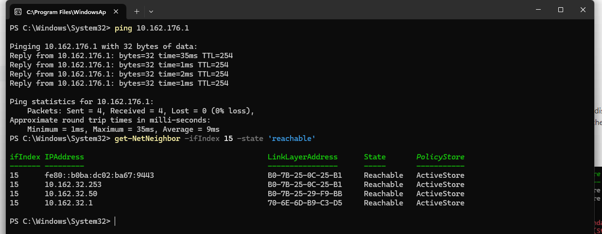
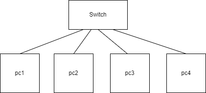
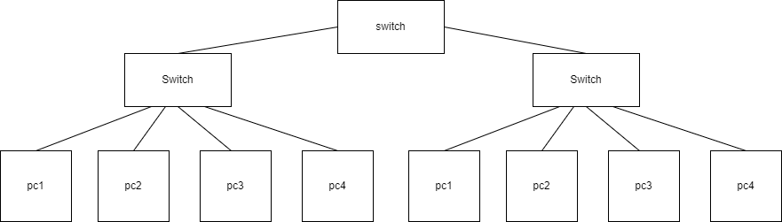
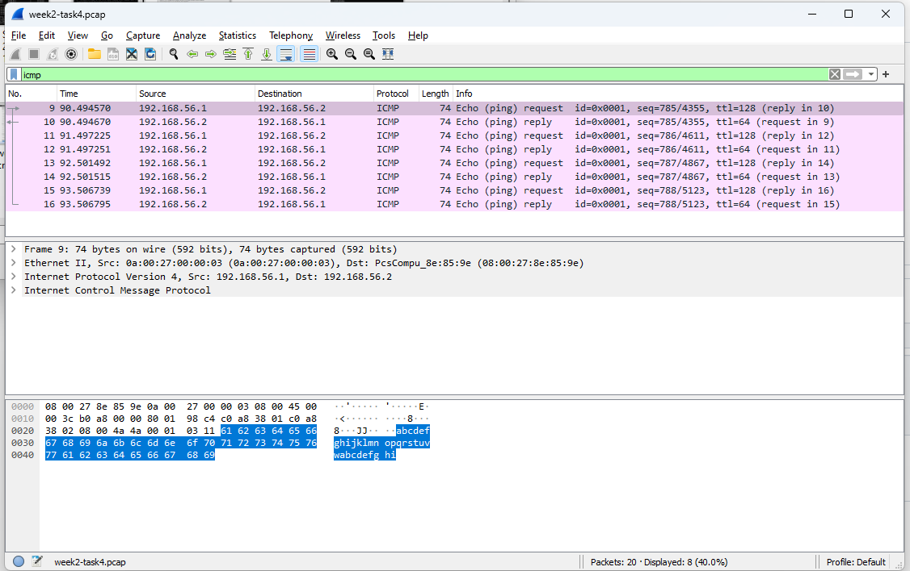
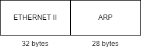

# Week-3

## Task 1

## Task 2. View ARP Table [20 min]

Screenshot of the ARP table, e.g. screenshot-arp-table.png.
• List the MAC addresses of at least two other devices you discovered are “Reachable” by viewing the 
ARP table. Explain which computer these MAC addresses belong to and why. (E.g. is it another 
computer in the lab? Why do you think that?

Get-NetAdapter  
get-NetNeighbor  
get-NetNeighbor -ifIndex  
get-NetNeighbor -ifIndex 8 -state 'reachable'  
the "LinkLayerAddress" in the ARP (Address Resolution Protocol) table typically represents the MAC (Media Access Control) address of the devices in the network.  
B0-7B-25-0C-25-B1  
B0-7B-25-0C-25-B1  
B0-7B-25-29-F9-BB  
70-6E-6D-B9-C3-D5  
Above those Mac addresses are belong to another computers. Because I used get-NetApater command that show me the another computer's IP and MaC addresses.

## Task 3. Draw Network Diagrams [30 min

  

  

[Drawio file here dont show in here](./images/week3task3-1.drawio)  

## Task 4. Analyse Ping Packet Capture [40 min]

a)    
b)  
c)  ARP (Address Resolution Protocol) packets are used to map IP addresses to MAC addresses on a local network.
ARP requests are sent by devices trying to determine the MAC address associated with a given IP address.
ARP replies are sent by devices that own the IP address in response to ARP requests, providing their MAC address.  
d)    
e) ICMP (Internet Control Message Protocol) packets are typically used for network troubleshooting and diagnostics.
Analyze the ICMP packets to determine their type  
f)  

## Task 5. Learning Reflection [20 min, Homework]

- get-NetApadter  
- ping to specific domain name  
- get-NetNeighbor  
- speedtest.net  
- Get-ComputerInfo -Property *memory*  
- Get-ComputerInfo -Property *processor*  
- test-connection
  
 Explanation of one tool and how it can be useful outside this unit.  
Speedtest.net seemed very important to me. Sometimes our home internet speed seems so slow couldn't even watch video on internet. At this time we should check the speed and if it is lower than our ISP provided speed, we should tell them. 
