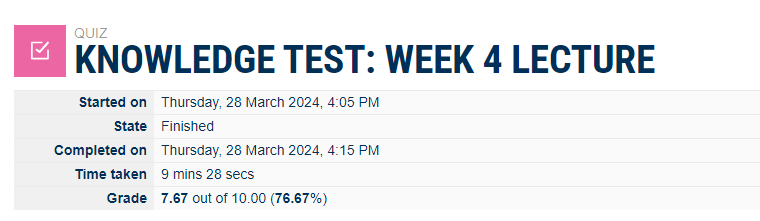
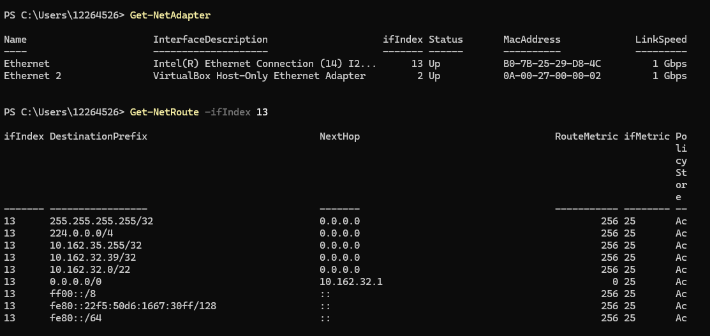
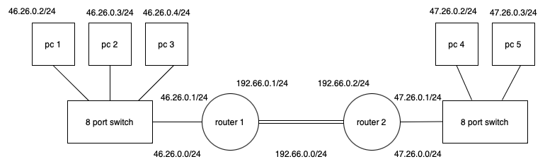
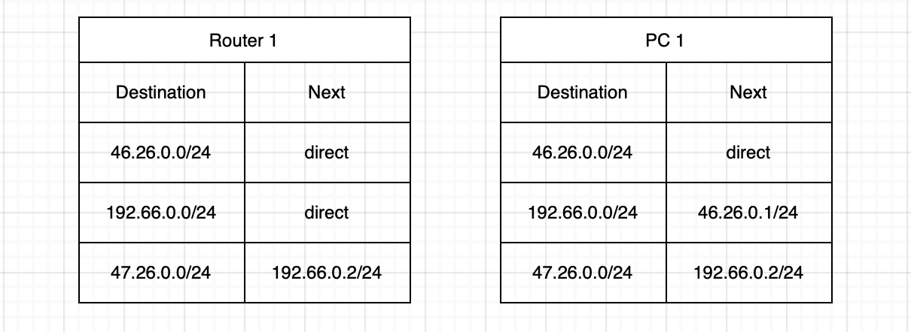
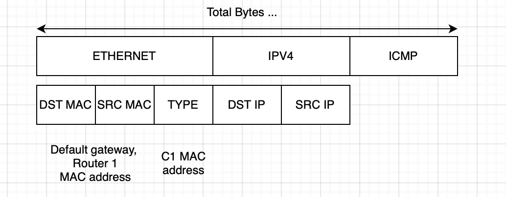
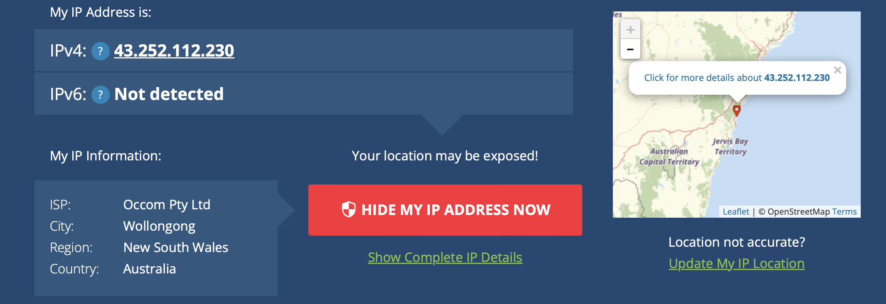
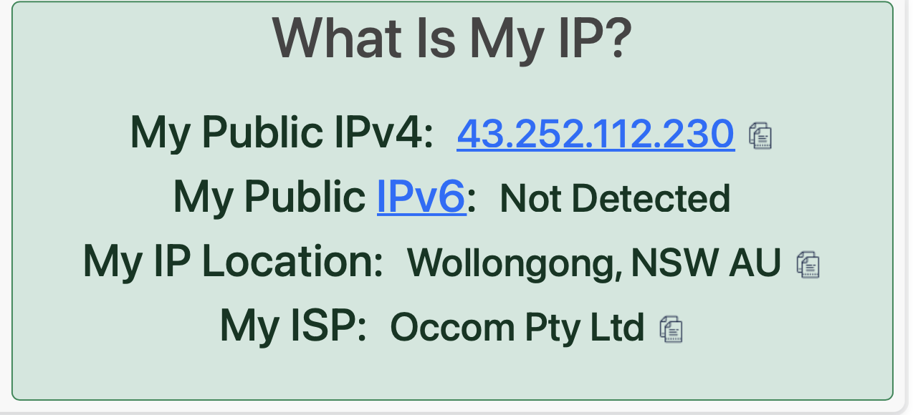
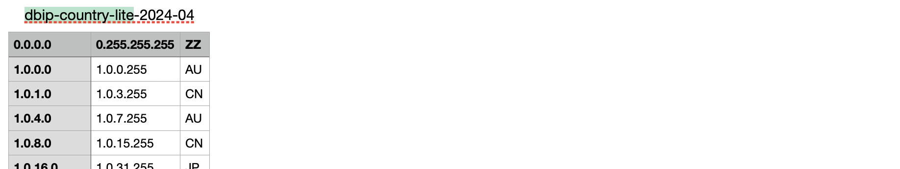

# Week 4

## Task 1. Complete the Knowledge Test [10 min

## Task 2. View Routing Table [20 min
  
The "get-netroute" command typically retrieves information from the routing table of a network device. Each row in the routing table provides essential information about how network traffic is directed within the network.

## Task 3. Project Initiation [20 min]
Its already made in different respitory

## Task 4. IP Network Design [40 min]
  
Drawio file here ->> [network diagram](./images/week4taskAB-network-diagram-withTable.drawio)  

Routing table
  
Drawio file here ->> [routing table](./images/week4taskAB-network-diagram-withTable-2.drawio)  

Packet diagram
  
Drawio file here ->> [Packet diagram](./images/week4taskAB-network-diagram-withTable-3.drawio)  

## Task 5. IP Address Lookup [10 min]
I used 2 different ip address finder web site those are https://whatismyipaddress.com, https://www.whatismyip.com
result shown below: It indicates my ISP providers ip address. I think. It does not show my exact location and my private computer IP address. 

Also, I downloaded csv file from this website https://db- ip.com/db/download/ip-to-country-lite. The file has ip addresses of countries. 

DB-IP's country-level geolocation databases are commonly used by applications and services that only require information about the country associated with an IP address. This can be useful for various purposes such as targeting content, detecting and preventing fraud, and analyzing website traffic patterns based on geographic regions. This version is free if we want more detailed version, we should pay for some fee for that.

## Task 6. IP Addresses, VPNs and Contract Cheating [30 min, Homework]

a) What are the reasons for and against bypassing geolocation (or geo-blocking) services with a VPN?  
Reason -> Some streaming company provide movies, video contents to their customers locally. They chose the target market location and to serve them. But There arise some issue, that some customers from outside of country who wants to watch that content without permission. So they use VPN service and hide their ip address and act like watching that content from the targeted location. 
My advice is -> I am not sure how to protect from this but it is ethical issue in ICT. So everyone have to be ethical and try to be right things to do. 

b) What are the reasons for and against a university using IP addresses to identify possible contract
cheating?  
Reason -> Obvious, this is cheating, some student does not understand their topics properly so they chose the wrong way to finish this subject. That is why they used someone to do their homework and assessments. 

c) What advice would you give future students regarding using a VPN while studying in Australia?  
My advise is -> same like before. Student means to be hungry for learning something, as much as possible to understand and practice a lot for studying new things for their future life, dream and job. To do right things make them improved students. Avoid from frauding something, do not fool yourself.
