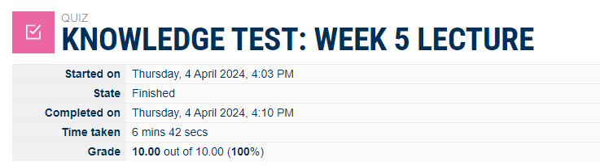
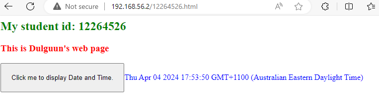
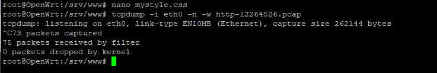
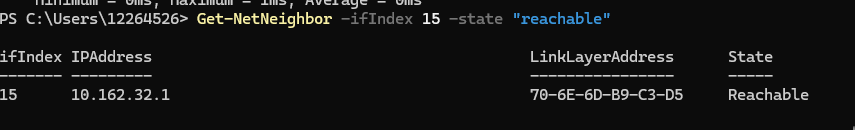
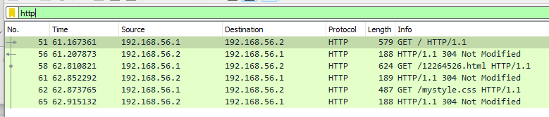

# Week 5

## Task 1. Complete the Knowledge Test [10 min

## Task 2. Create Web Pages in OpenWRT [30 min]
  
[index.html](./images/index.html)  
[12264526.html](./images/12264526.html)  
[mystyle.css](./images/mystyle.css)  

## task 3. Capture HTTP Packets [20 min]
 

http-12264526.pcap
[http-12264526.pcap](./images/http-12264526.pcap)  
  

## Task 4. Analyse HTTP Packet Capture [40 min]

  
