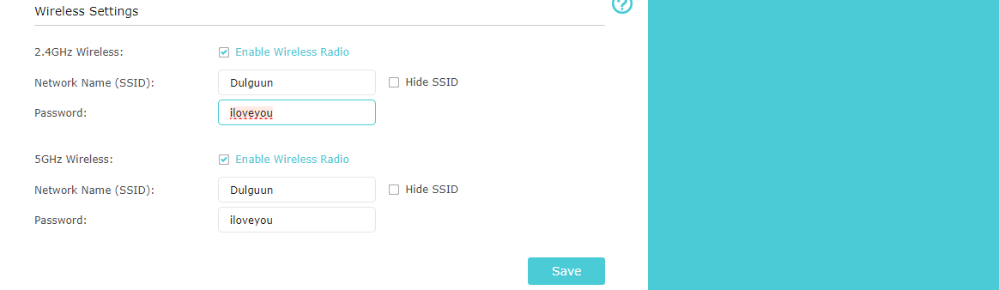

# Week 06 Tutorial Activities

## Task 1. Complete the Knowledge Test [10 min]  

## Task 2. View Wi-Fi Details [20 min]  
  

APs: SSID, CQUniGues
BSSID, f4:bd:9e:9e:2b:01
frequency band, 2462MHz
channel, CH11
data rate, 

## Task 3. Use Wi-Fi Access Point [30 min]  
  

  
